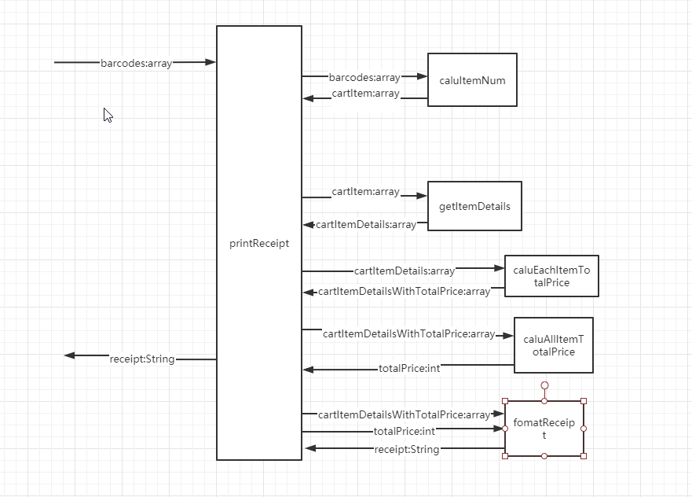

# Tasking

- ### 1. 统计每个item的个数
  * 输入：barcodes：[string]
  * 输出：cartItems：[{itemCode:string,quantiy:int}]

- ### 2. 获取每个item的详细信息
  * 输入：cartItems：[{itemCode:string,quantiy:int}]
  * 输出：cartItemDetails：[{itemCode:string,name:string,quantiy:int,unitPrice:int}]
  
- ### 3. 计算每个item的总价格
  * 输入： cartItemDetails：[{itemCode:string,name:string,quantiy:int,unitPrice:int}]
  * 输出：cartItemDetailsWithTotalPrice：[{itemCode:string,name:string,quantiy:int,unitPrice:int,totalPrice:int}]

- ### 4. 计算所有item的总价
  * 输入：cartItemDetailsWithTotalPrice：[{itemCode:string,name:string,quantiy:int,unitPrice:int,totalPrice:int}]
  * 输出：totalPrice

- ### 5. 格式化数据
  * 输入：cartItemDetailsWithTotalPrice：[{itemCode:string,name:string,quantiy:int,unitPrice:int,totalPrice:int}]，totalPrice
  * 输出：receipt:string

- ### 6. 输出数据
  * 输入：receipt
  * 输出：console.log(receipt)

  
caluItemNum()|Description
--|:--:|--:
P|5min
D|12min
C|在js中，忘记怎么获取相同字符串的个数和对数组去重
A|需要多加练习这些方法

getItemDetails()|Description
--|:--:|--:
P|3min
D|10min
C|难在合并两个对象
A|使用了Object.assign合并两个对象

caluEachItemTotalPrice()|Description
--|:--:|--:
P|3min
D|2min
C|这个只用一个foreach循环，然后得出quantity * price的总价格
A|这个比较简单

caluAllItemTotalPrice()|Description
--|:--:|--:
P|2min
D|2min
C|这个只用一个foreach循环，然后得出每个item的totalPrice的和
A|这个比较简单

fomatReceipt()|Description
--|:--:|--:
P|5min
D|5min
C|这个知识拼接字符串，相对简单
A|暂时没什么难点

  